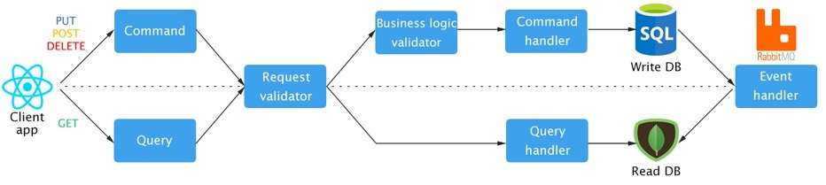

#  ITFriends
***Сontent distribution .NET microservice application using CQRS with multiple databases and Clean Architecture.***

## :bookmark_tabs: Technology stack
* Programming language: **C# 9**
* Framework: **.NET 5**
* Database and ORM: **SQL Server + EF Core (for writing), MongoDB + MongoDB Driver (readable)**
* Identity managment: **Identity server 4**
* IoC: **Autofac**
* Event Bus: **MassTransit + RabbitMQ**
* Task Scheduler: **Hangfire + Redis**
* Testing: **NUnit + FluentAssertion + Moq**
* Mapping: **AutoMapper**
* Logging: **Serilog**
* Optional: **MediatR (CQRS + Application Architecture Organization)**


## 🌁 Application architecture


## 👷 Application pipeline
***The movement of data within an application is a pipeline. For this, MediatR is used.***



### 1st step (command / query): ###
The request from the client goes to the controller. 
POST, PUT, DELETE requests are mapped to commands.
GET requests are mapped to query.
Next, a command or query is sent to the Mediatr's pipeline.

```csharp
[HttpPut]
[Route("topic/{topicId:int}/edit")]
[Authorize(Roles = "admin,moderator")]
public async Task<IActionResult> EditTopic([FromRoute] int topicId, [FromBody] EditTopicRequest request)
{
  var command = new EditTopicCommand {TopicId = topicId, Title = request.Title};

  await _mediator.Send(command);

  return Ok();
}
```

### 2st step (request validator): ###
Request validator validates request from the client using the FluentValidator.

```csharp
public class CreateTopicMessageCommandRequestValidator : AbstractValidator<CreateTopicMessageCommand>
{
	public CreateTopicMessageCommandRequestValidator(
		TopicMessageTitleValidator topicMessageTitleValidator, 
		TopicMessageHtmlValidator topicMessageHtmlValidator)
	{
		RuleFor(c => c.Title)
			.NotNull()
			.SetValidator(topicMessageTitleValidator);

		RuleFor(c => c.Html)
			.NotNull()
			.SetValidator(topicMessageHtmlValidator);

		RuleFor(c => c.CreatorAppUserId)
			.NotNull()
			.NotEmpty();
	}
}
```

### 3st step (business logic validator): ###
Business logic validator validate business logic, usually referring to the database.

```csharp
public class CreateTopicMessageCommandBLValidator : IBusinessLogicValidator<CreateTopicMessageCommand>
{
	private readonly ITopicExistsValidator _topicExistsValidator;
	private readonly IAppUserExistsValidator _appUserExistsValidator;

	public CreateTopicMessageCommandBLValidator(
		ITopicExistsValidator topicExistsValidator, 
		IAppUserExistsValidator appUserExistsValidator)
	{
		_topicExistsValidator = topicExistsValidator;
		_appUserExistsValidator = appUserExistsValidator;
	}

	public async Task ValidateAndThrow(CreateTopicMessageCommand instance)
	{
		await _topicExistsValidator.ValidateThatTopicWithIdExistsAndThrow(instance.TopicId);
		await _appUserExistsValidator.ValidateThatUserWithIdExistsAndThrow(instance.CreatorAppUserId);
	}
}

```

### 4st step (query / command handler): ###
Query / command handler processes the request itself. They connect to read database if it is query and
to write database, if it is command.
When data changes, asynchronous synchronization occurs using MassTransit and RabbitMQ.

**Query handler (used MongoDB read database for fetch materialized view data):**
```csharp
public class GetTopicQueryHandler : IRequestHandler<GetTopicQuery, GetTopicQueryDto>
{
	private readonly ITopicRepository _topicRepository;

	public GetTopicQueryHandler(ITopicRepository topicRepository)
	{
		_topicRepository = topicRepository;
	}

	public async Task<GetTopicQueryDto> Handle(GetTopicQuery request, CancellationToken cancellationToken)
	{
		var topic =  await _topicRepository.GetByTopicId(request.TopicId);
		
		if (topic == null)
			throw new BusinessLogicValidationException(BusinessLogicErrors.ResourceNotFoundError, $"Topic with id = {request.TopicId} not found");

		return new GetTopicQueryDto {Topic = topic};
	}
}
```

**Command handler (used SQL Server write database for changing data and causes synchronization between write and read databases):**
```csharp
public class DeleteTopicCommandHandler : IRequestHandler<DeleteTopicCommand, Unit>
{
	private readonly AppDbContext _context;
	private readonly IPublishEndpoint _publishEndpoint;

	public DeleteTopicCommandHandler(AppDbContext appDbContext, IPublishEndpoint publishEndpoint)
	{
		_context = appDbContext;
		_publishEndpoint = publishEndpoint;
	}

	public async Task<Unit> Handle(DeleteTopicCommand request, CancellationToken cancellationToken)
	{
		var deletedTopic = new Infrastructure.Domain.Write.Topic {TopicId = request.TopicId};
		
		_context.Topics.Remove(deletedTopic);

		await _context.SaveChangesAsync(cancellationToken);

		await PublishEvent(request.TopicId);
		
		return Unit.Value;
	}

	private async Task PublishEvent(int topicId)
	{
		await _publishEndpoint.Publish(new TopicDeletedEvent {TopicId = topicId});
	}
}
```

### 5st step (database synchronization): ###
All data required for a change in read database is passed in an event message. This reduces reads to the database by increasing the processing of GET requests.

```csharp
public class TopicMessageDeletedDbSynchronizer : IConsumer<TopicMessageDeletedEvent>
{
	private readonly ITopicMessageRepository _topicMessageRepository;
	private readonly ITopicRepository _topicRepository;

	public TopicMessageDeletedDbSynchronizer(ITopicMessageRepository topicMessageRepository, ITopicRepository topicRepository)
	{
		_topicMessageRepository = topicMessageRepository;
		_topicRepository = topicRepository;
	}

	public async Task Consume(ConsumeContext<TopicMessageDeletedEvent> context)
	{
		var topicMessageId = context.Message.TopicMessageId;

		await _topicMessageRepository.Delete(topicMessageId);
		await _topicRepository.DeleteTopicMessageInfo(topicMessageId);
	}
}
```
